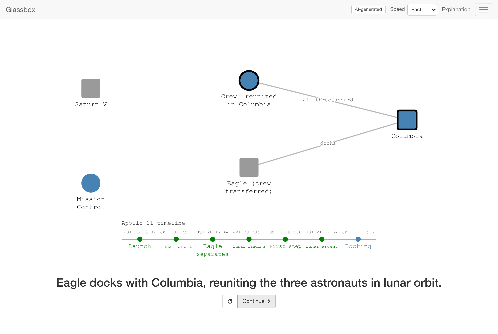

<div align="center">

# Glassbox

**See how systems work, one change at a time.**

Type a topic. Glassbox plans, draws, checks, and reviews a short animated story that explains it,<br>
then plays it one sentence at a time, in the spirit of [The Secret Lives of Data](https://thesecretlivesofdata.com/raft/).

[](LICENSE)


</div>

---

## What it is

Glassbox explains technical concepts as narrated, step-by-step animations: servers and clients as circles, messages travelling between them, logs filling up, code highlighting line by line, tables filling in, and the camera zooming in where it matters. Each step changes one thing and says why.

- **Generate any fitting topic.** An AI pipeline plans the explanation, draws it as validated scene data, checks it with code, has a second model review it, and revises up to three times. Only a draft that passes every check is shown.
- **Hand-written stories** for HTTP and Kafka show what the format can do.
- **No accounts and no database.** Explanations you generate are saved in your own browser.
- **Works without an API key** in demo mode, with the bundled examples and stories.

<table>
  <tr>
    <td width="50%"></td>
    <td width="50%"></td>
  </tr>
  <tr>
    <td><em>Type a topic, or try a suggestion.</em></td>
    <td><em>Real progress, stage by stage: no fake percentages.</em></td>
  </tr>
  <tr>
    <td></td>
    <td></td>
  </tr>
  <tr>
    <td><em>AI-generated: code and the table it fills, zoomed in.</em></td>
    <td><em>AI-generated: a timeline of events, technical or not.</em></td>
  </tr>
</table>


<p align="center"><em>Everything you generate is saved in your browser's library.</em></p>

---

## Features

- **A player you control.** One sentence at a time; press **Continue** or **→**, replay with **←**. Chapters with links (`/learn/kafka#replication`), a speed control (Slow, Normal, Fast), keyboard support, a screen-reader live region, and reduced motion that shows each step finished.
- **A small visual language.** Nodes with roles and states; messages that travel in rounds, so a reply follows its request; and panels for a **log** (records, queues, stacks, commits), **code** (with the running line highlighted), a **table** (cells filling in), and a **timeline** (dated events). The camera can zoom onto a panel.
- **Careful generation.** A planner declines topics that don't fit and suggests narrower ones. A generator writes strict JSON. Code checks references, limits, layout, and overlaps. A reviewer checks accuracy and teaching quality. Failing drafts are revised, at most three times in total.
- **Safe by design.** The AI writes data, never code. Its output is validated against one schema, rendered only as plain text with application-owned shapes and colors, and always labeled as AI-generated.
- **Private by default.** Nothing is stored on the server. The OpenAI key stays on the server; visitors' IP addresses are only kept as keyed hashes for rate limiting, in memory.

---

## Quick start

Requires **Node.js 22.12 or newer**.

```bash
git clone https://github.com/Hrist0ff/glassbox.git
cd glassbox
npm install
npm run dev                        # http://localhost:3000
```

That runs **demo mode**: the hand-written stories and bundled examples, with no AI calls.

To generate your own explanations, add an OpenAI API key:

```bash
cp .env.example .env.local
# then set OPENAI_API_KEY=sk-... in .env.local
npm run dev
```

Type a topic on the home page. After a minute or two the explanation opens and is saved in **Your library**.

---

## What topics work

Glassbox can show anything that can be explained as a few actors, messages, and changing state, plus up to three panels.

| Works well | Declined (with a narrower suggestion) |
| --- | --- |
| Protocols: HTTP, TCP handshake, DNS, TLS, OAuth | Charts, plots, and continuous math |
| Distributed systems: Raft, two-phase commit, consistent hashing, replication | Rendered formulas |
| Data structures and algorithms: binary search, Bloom filters, hash tables | Images, maps, and spatial drawing |
| Code walkthroughs on small inputs: recursion, loops | Topics too vague to explain responsibly |
| Table-filling algorithms: dynamic programming, joins | |
| Logs, queues, and streams: Kafka, Git history | |
| Processes and histories: Apollo 11, how a bill becomes law | |

The AI review is a quality check, not proof of correctness, and no sources are consulted. Verify anything important.

---

## Cost

Measured over three runs of the 16-topic evaluation set with the default model (`gpt-6-luna`):

| | |
| --- | --- |
| Typical explanation | **$0.005–0.010**, about 1–2 minutes |
| Declined topic | about $0.0003, a few seconds |
| Worst case (7 AI calls at their output limits) | about $0.06 |
| Good topics accepted | 79–93% per run (the rest fail review or run out of time; retrying often works) |

Explaining 100 topics costs roughly **$0.50–1.00**. The hourly limits below cap how much a public deployment can spend.

---

## Configuration

Set these in `.env.local` (see [`.env.example`](.env.example)).

| Variable | Default | Purpose |
| --- | --- | --- |
| `OPENAI_API_KEY` | none | Enables generation. Without it, the app runs in demo mode. Server-only. |
| `OPENAI_MODEL` | `gpt-6-luna` | Model for all three roles. |
| `OPENAI_EXTRACTOR_MODEL`, `OPENAI_GENERATOR_MODEL`, `OPENAI_EVALUATOR_MODEL` | `OPENAI_MODEL` | Per-role overrides. |
| `OPENAI_REASONING_EFFORT` | model default | `none` to `high`; leave unset for models without it. |
| `GENERATION_MODE` | automatic | `demo` forces demo mode; `live` requires a key. |
| `GENERATION_DEADLINE_MS` | `270000` | Server deadline per request (30–290 s). |
| `RATE_LIMIT_PER_CLIENT_PER_HOUR` | `5` | Generations per visitor per hour. |
| `RATE_LIMIT_GLOBAL_PER_HOUR` | `100` | Generations for the whole site per hour; caps your OpenAI cost. |

---

## Deploying

Glassbox is a standard Next.js app with no database, so it deploys anywhere Node.js runs. On **Vercel**:

1. Import the repository and set `OPENAI_API_KEY` (server-only, no `NEXT_PUBLIC_` prefix).
2. Keep `RATE_LIMIT_GLOBAL_PER_HOUR` at a level whose cost you accept: anyone who can reach the site can generate.
3. The generate route uses `maxDuration = 300`, which needs Fluid Compute (the default). On a platform with a shorter limit, lower `GENERATION_DEADLINE_MS` to about 20 s below it.

Rate limits live in server memory, so on serverless platforms they apply per instance. Saved explanations live in each visitor's browser, so their links can't be shared with other people.

---

## Writing a story by hand

The `/learn` stories are plain data written with small helpers. A story is chapters of beats; each beat has a caption and a timed script:

```ts
import { add, node, packet, send } from "@/lib/story/dsl";
import type { Story } from "@/lib/story/types";

export const ping: Story = {
  slug: "ping",
  title: "Ping",
  subtitle: "A message and its reply",
  summary: "A client asks, a server answers.",
  chapters: [
    {
      id: "intro",
      title: "Ping",
      beats: [
        { title: { heading: "Ping", sub: "A message and its reply" } },
        {
          say: "A [client|green] sends a *ping* to a [server|steelblue]...",
          run: [
            add(node("client", 25, 50, "green", { desc: ["client"] })),
            add(node("server", 75, 50, "steelblue", { desc: ["server"] }), 300),
            send("client", "server", packet("ping"), { after: 300, then: [send("server", "client", packet("pong"))] }),
          ],
        },
      ],
    },
  ],
};
```

Add it to `lib/stories/index.ts` and it appears under **Visualizations** at `/learn/ping`. The tests lint every story: every action must refer to something on stage, and nothing may be drawn off-screen. See [`lib/stories/http.ts`](lib/stories/http.ts) and [`lib/stories/kafka.ts`](lib/stories/kafka.ts) for full examples.

---

## Development

| Command | |
| --- | --- |
| `npm run dev` | Development server |
| `npm run check` | Typecheck, lint, unit tests, and a production build |
| `npm test` | Unit tests (Vitest) |
| `npm run e2e` | Browser tests (Playwright) against a running app |
| `npm run eval:prompts -- --label <name>` | Run the evaluation topics through the real pipeline (costs about $0.13) |
| `npm run smoke:live -- "topic"` | Generate one explanation from the command line (real API) |

How it all fits together, from the scene format to the streaming protocol and the tests, is in **[docs/ARCHITECTURE.md](docs/ARCHITECTURE.md)**.

---

## Limitations

- Only topics that fit the visual language work; others are declined.
- Automated review uses the same family of model as the generator and has no sources. It catches many mistakes, but not all.
- One or two generations in ten fail review or run out of time, and cost a cent or two each; retrying often works.
- Saved explanations stay in the browser that made them; links don't work elsewhere, and clearing site data removes them.
- Generation runs inside the request: closing the tab cancels it.

---

## Credits

Inspired by **[The Secret Lives of Data](https://github.com/benbjohnson/thesecretlivesofdata)** by Ben Johnson, whose Raft visualization shows how much a few circles, dots, and one sentence at a time can teach. Glassbox is an independent project and is not affiliated with it.

## License

[MIT](LICENSE)
