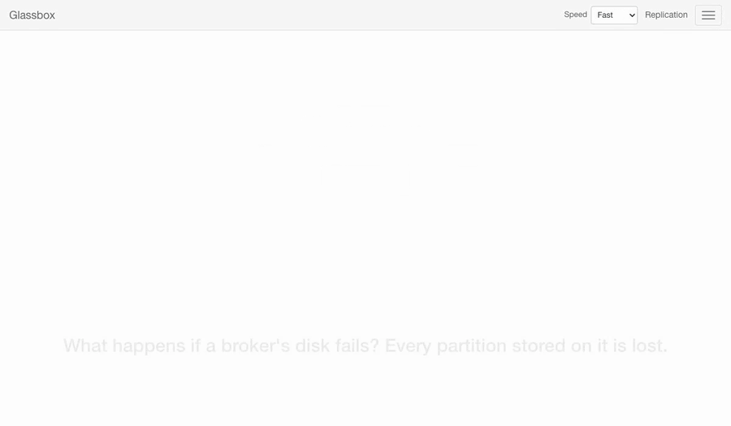
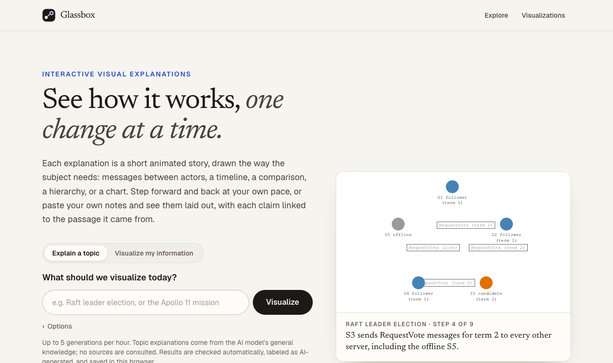
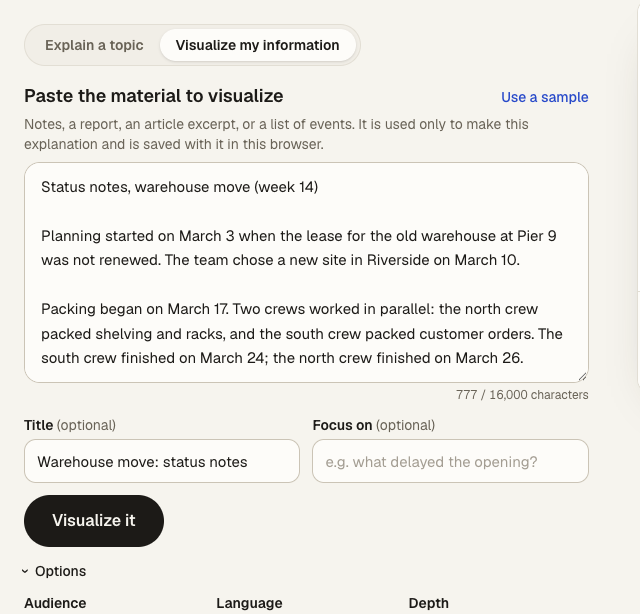
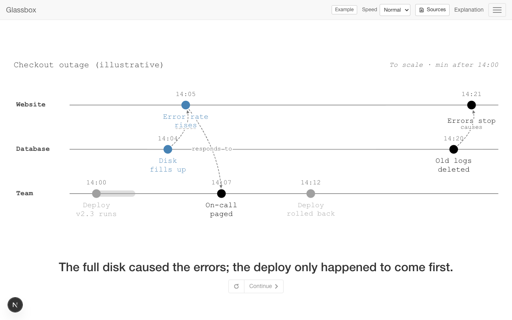
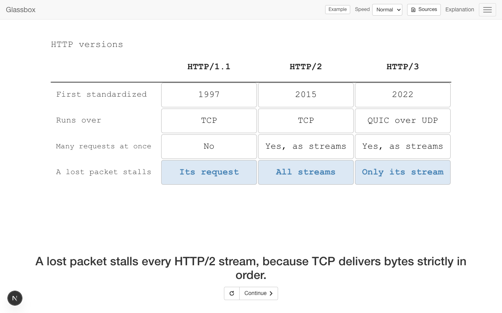
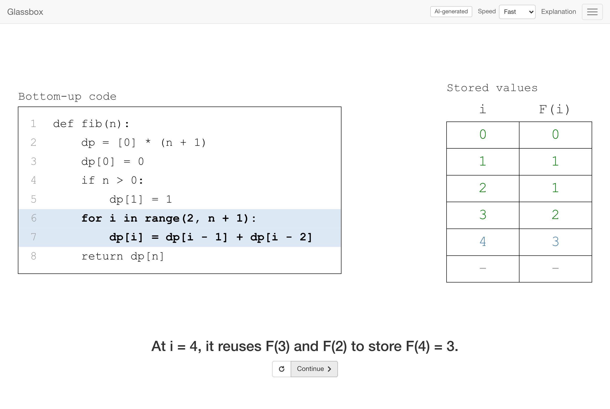
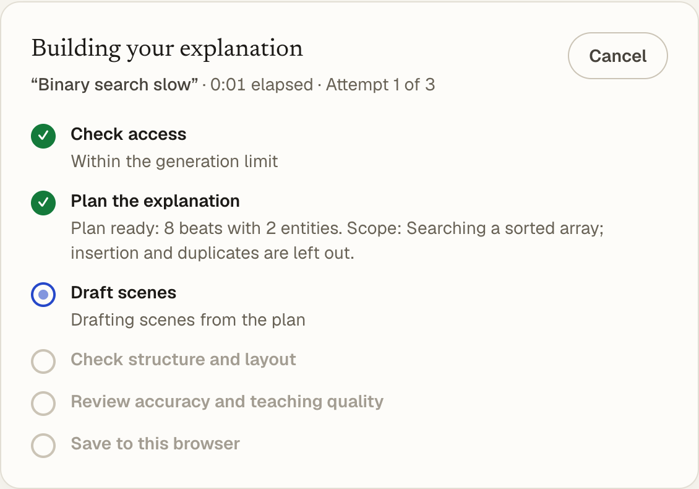
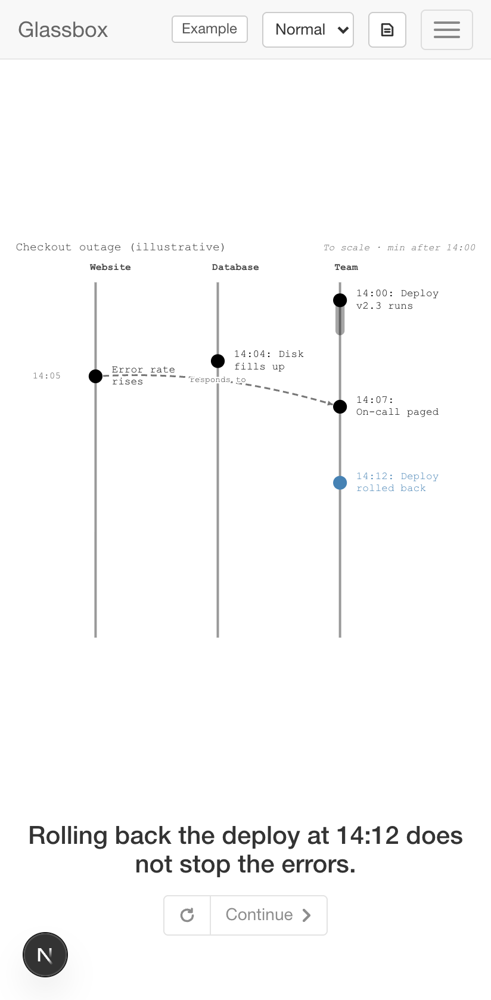
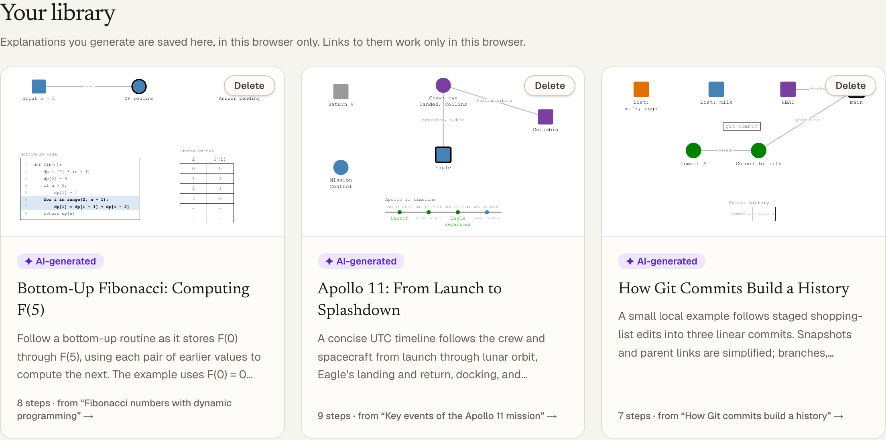

<div align="center">

# Glassbox

**See how it works, one change at a time.**

Type a topic, or paste your own notes. Glassbox plans, draws, checks, and reviews a short animated story that explains it,<br>
then plays it one sentence at a time, in the spirit of [The Secret Lives of Data](https://thesecretlivesofdata.com/raft/).

[](LICENSE)




</div>

---

## What it is

Glassbox explains how things work, what happened, how options differ, and how things are organized, as narrated, step-by-step animations. It picks the view the subject needs: servers and clients exchanging messages, code highlighting line by line beside the table it fills, a timeline with lanes for parallel work, a comparison of alternatives against criteria, a hierarchy, or a chart. Each step changes one thing and says why.

- **Explain a topic.** An AI pipeline decides what you should come away understanding, chooses a view, draws it as validated data, checks it with code, has a second model review it, and revises up to three times. Only a draft that passes every check is shown.
- **Visualize your own information.** Paste notes, a report, or a list of events. Glassbox lists the claims in it, checks that every quoted excerpt really appears in your text, and links each step to the passages it rests on. Contradictions and gaps are shown, not smoothed over.
- **Sources and assumptions, step by step.** A drawer shows what the current step rests on, and what the explanation covers, leaves out, and assumes. Topic explanations say plainly that no sources were consulted.
- **Explore a step.** Ask for an explanation of the step, a simpler version, or another example; each is reviewed and kept beside the step.
- **Works on phones.** Explanations are laid out again for tall screens, so tables, timelines, and charts stay readable.
- **No accounts and no database.** Everything you generate is saved in your own browser.
- **Works without an API key** in demo mode, with the bundled examples and stories.

<table>
  <tr>
    <td width="50%"></td>
    <td width="50%"></td>
  </tr>
  <tr>
    <td><em>Type a topic, or paste your own notes.</em></td>
    <td><em>Pasted material: every claim is linked to its passage.</em></td>
  </tr>
  <tr>
    <td></td>
    <td></td>
  </tr>
  <tr>
    <td><em>Timelines: lanes, durations, spacing that says if it is to scale, and only stated causes.</em></td>
    <td><em>Comparisons: criteria revealed row by row; unknown or not-applicable values are marked, never guessed.</em></td>
  </tr>
  <tr>
    <td></td>
    <td></td>
  </tr>
  <tr>
    <td><em>AI-generated: code and the table it fills, zoomed in.</em></td>
    <td><em>Real progress, stage by stage: no fake percentages.</em></td>
  </tr>
</table>

<p align="center"></p>

<p align="center"><em>On phones, explanations are laid out again for the tall screen.</em></p>



<p align="center"><em>Everything you generate is saved in your browser's library.</em></p>

---

## Features

- **A player you control.** One sentence at a time; press **Continue** or **→**, replay with **←**. Chapters with links (`/learn/kafka#replication`), a speed control (Slow, Normal, Fast), keyboard support, a screen-reader live region, and reduced motion that shows each step finished.
- **A small visual language.** Nodes with roles and states; messages that travel in rounds, so a reply follows its request; and panels for a **log**, **code** (the running line highlighted), a **table**, a **timeline** (lanes, durations, dates or explicitly unknown dates, evenly spaced or to scale, with a label saying which, and only stated cause-and-effect links), a **comparison** (alternatives against criteria with units; unknown and not-applicable values marked, never guessed or ranked), a **hierarchy** (trees and groups, with the relation named), and a **chart** (bars or lines, missing values marked, illustrative numbers labeled). The camera zooms where it matters.
- **Careful generation.** A planner states the learning goal and picks the representation before designing scenes, and declines what the player can't show with alternatives that would work. A generator writes strict JSON without coordinates; application code lays it out. Code checks references, limits, layout, overlaps, and citations. A reviewer sees your original request and checks fidelity, accuracy, and teaching quality. Failing drafts are revised, at most three times in total.
- **Safe by design.** The AI writes data, never code. Its output is validated against one schema, rendered only as plain text with application-owned shapes and colors, and always labeled as AI-generated. Pasted material is treated as data: instructions inside it are ignored, and that is recorded.
- **Private by default.** Nothing is stored on the server. The OpenAI key stays on the server; visitors' IP addresses are only kept as keyed hashes for rate limiting, in memory.

---

## Quick start

Requires **Node.js 22.12 or newer**.

```bash
git clone https://github.com/Hrist0ff/glassbox.git
cd glassbox
npm install
npm run dev                        # http://localhost:3000
```

That runs **demo mode**: the hand-written stories and bundled examples, with no AI calls.

To generate your own explanations, add an OpenAI API key:

```bash
cp .env.example .env.local
# then set OPENAI_API_KEY=sk-... in .env.local
npm run dev
```

Type a topic on the home page, or switch to **Visualize my information** and paste text (or use the sample). After a minute or two the explanation opens and is saved in **Your library**. Under **Options** you can choose the audience, language, and depth.

---

## What works

Glassbox shows what can be explained with a few actors and messages, or with one of its panels, in a short linear story.

| View | Good for | Examples |
| --- | --- | --- |
| Actors and messages | Protocols, requests, consensus, decision procedures | TCP handshake, DNS, Raft, OAuth |
| Code beside data | Short functions on small inputs | Binary search, Fibonacci with dynamic programming |
| Changing data | Logs, queues, tables | Kafka, hash tables, Git history |
| Timeline | Histories, processes, incidents, projects with parallel work | Apollo 11, an incident review, how a bill becomes law |
| Comparison | Alternatives against explicit criteria | Mitosis vs meiosis, HTTP/1.1 vs HTTP/2 vs HTTP/3 |
| Hierarchy | Organizations, taxonomies, system structure | The U.S. federal government, how vertebrates are classified |
| Chart | Amounts across categories or over time, from your data or clearly labeled illustrations | Compound interest, quarterly sales from your notes |

Declined, with suggestions that would work: images, maps, plots of continuous functions, rendered formulas, and requests too vague to explain responsibly. Ambiguous requests ("Mercury") get a choice of readings. Links are not opened: paste the text instead.

Topic explanations come from the AI model's general knowledge; no sources are consulted. Explanations of your material are only as reliable as the material, and are not checked against other sources. The AI review is a quality check, not proof of correctness. Verify anything important.

---

## Cost

Measured with the default model (`gpt-6-luna`) over the 23-case evaluation set, two repeats per case (see [docs/EVALS.md](docs/EVALS.md)):

| | |
| --- | --- |
| Typical explanation of a topic | **about $0.003–0.016**, median about $0.006, 40 s to 2.5 minutes |
| Explanation of pasted material (one more AI call) | median about $0.008, up to about 4 minutes when drafts need repair |
| Declined request | under $0.001, a few seconds |
| Explain or simplify a step | under a cent, about 5–15 s |
| A run that fails all three drafts | about $0.01–0.02 |
| Worst case (9 AI calls at their output limits) | about $0.08 |

Explaining 100 topics costs roughly **$0.60–1.00**. The hourly limits below cap how much a public deployment can spend. Running the full evaluation (46 runs) costs about $0.33 for the pipeline plus about $0.43 for the independent grader. In the latest full run, 87% of answerable requests were accepted (the rest failed review or a check; retrying often works) and every unsupported or ambiguous request was declined with alternatives.

---

## Configuration

Set these in `.env.local` (see [`.env.example`](.env.example)).

| Variable | Default | Purpose |
| --- | --- | --- |
| `OPENAI_API_KEY` | none | Enables generation. Without it, the app runs in demo mode. Server-only. |
| `OPENAI_MODEL` | `gpt-6-luna` | Model for every role. |
| `OPENAI_EXTRACTOR_MODEL`, `OPENAI_GENERATOR_MODEL`, `OPENAI_EVALUATOR_MODEL` | `OPENAI_MODEL` | Per-role overrides (the material reader uses the extractor's model, the step writer the generator's). |
| `OPENAI_REASONING_EFFORT` | model default | `none` to `high`; leave unset for models without it. |
| `GENERATION_MODE` | automatic | `demo` forces demo mode; `live` requires a key. |
| `GENERATION_DEADLINE_MS` | `270000` | Server deadline per request (30–290 s). |
| `RATE_LIMIT_PER_CLIENT_PER_HOUR` | `5` | Generations per visitor per hour. |
| `RATE_LIMIT_GLOBAL_PER_HOUR` | `100` | Generations for the whole site per hour; caps your OpenAI cost. Exploring a step counts as a generation. |
| `EVAL_GRADER_MODEL` | `gpt-6.1-sol` | Only for `npm run eval:prompts`: the independent grader. |

---

## Deploying

Glassbox is a standard Next.js app with no database, so it deploys anywhere Node.js runs. On **Vercel**:

1. Import the repository and set `OPENAI_API_KEY` (server-only, no `NEXT_PUBLIC_` prefix).
2. Keep `RATE_LIMIT_GLOBAL_PER_HOUR` at a level whose cost you accept: anyone who can reach the site can generate.
3. The generate route uses `maxDuration = 300`, which needs Fluid Compute (the default). On a platform with a shorter limit, lower `GENERATION_DEADLINE_MS` to about 20 s below it.

Rate limits live in server memory, so on serverless platforms they apply per instance. Saved explanations live in each visitor's browser, so their links can't be shared with other people.

---

## Writing a story by hand

The `/learn` stories are plain data written with small helpers. A story is chapters of beats; each beat has a caption and a timed script:

```ts
import { add, node, packet, send } from "@/lib/story/dsl";
import type { Story } from "@/lib/story/types";

export const ping: Story = {
  slug: "ping",
  title: "Ping",
  subtitle: "A message and its reply",
  summary: "A client asks, a server answers.",
  chapters: [
    {
      id: "intro",
      title: "Ping",
      beats: [
        { title: { heading: "Ping", sub: "A message and its reply" } },
        {
          say: "A [client|green] sends a *ping* to a [server|steelblue]...",
          run: [
            add(node("client", 25, 50, "green", { desc: ["client"] })),
            add(node("server", 75, 50, "steelblue", { desc: ["server"] }), 300),
            send("client", "server", packet("ping"), { after: 300, then: [send("server", "client", packet("pong"))] }),
          ],
        },
      ],
    },
  ],
};
```

Add it to `lib/stories/index.ts` and it appears under **Visualizations** at `/learn/ping`. The tests lint every story: every action must refer to something on stage, and nothing may be drawn off-screen. See [`lib/stories/http.ts`](lib/stories/http.ts) and [`lib/stories/kafka.ts`](lib/stories/kafka.ts) for full examples.

---

## Development

| Command | |
| --- | --- |
| `npm run dev` | Development server |
| `npm run check` | Typecheck, lint, unit tests, and a production build |
| `npm test` | Unit tests (Vitest) |
| `npm run e2e` | Browser tests (Playwright) against a running app |
| `npm run eval:prompts -- --label <name>` | Run the evaluation cases through the real pipeline, check and grade the results (see Cost) |
| `npm run smoke:live -- "topic"` | Generate one explanation from the command line (real API); `-- --file notes.txt "Title"` for material |

How it all fits together, from the scene format to the streaming protocol and the tests, is in **[docs/ARCHITECTURE.md](docs/ARCHITECTURE.md)**.

---

## Limitations

- Only requests that fit one of the views work; others are declined with alternatives. Explanations are linear: there are no branching "what if" simulations yet (see [ARCHITECTURE.md](docs/ARCHITECTURE.md#deferred-scenarios-and-what-if)).
- Material can only be pasted as text (up to 16,000 characters). URLs and files are not read.
- The automated reviewer uses the same family of model as the generator, and has no sources beyond your material. It catches many mistakes, but not all.
- Some generations fail review or run out of time, and cost a cent or two each; retrying often works.
- Saved explanations stay in the browser that made them; links don't work elsewhere, and clearing site data removes them.
- Generation runs inside the request: closing the tab cancels it.

---

## Credits

Inspired by **[The Secret Lives of Data](https://github.com/benbjohnson/thesecretlivesofdata)** by Ben Johnson, whose Raft visualization shows how much a few circles, dots, and one sentence at a time can teach. Glassbox is an independent project and is not affiliated with it.

## License

[MIT](LICENSE)
